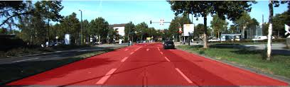
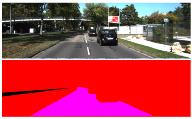
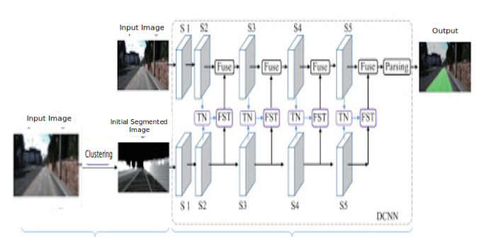
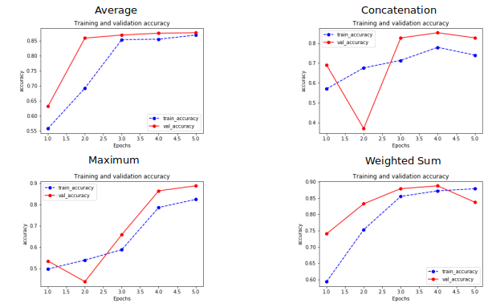
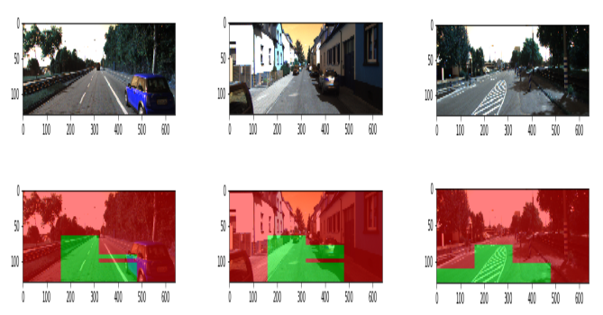
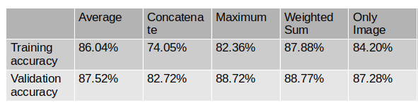

# Road Segmentation Using Feature Fusion

## Project Overview
This project implements road segmentation using a novel feature fusion approach. It combines features extracted from original images and their K-means clustered versions to improve road detection accuracy.

## Author
Isa Ali

## Introduction
Road detection is crucial for autonomous vehicle navigation. Despite advancements in visual image-based road detection, challenges persist due to illumination changes and image quality issues. This project aims to enhance road segmentation by fusing features from original and pre-segmented images.

## Dataset
The project uses the Kitti Road/Lane Detection Evaluation 2013 dataset, which includes:
- 289 training images
- 290 test images
- Three categories: urban unmarked (uu), urban marked (um), and urban multiple marked lanes (umm)

## Methodology
1. **Image Preprocessing**: 
   - K-means clustering for initial image segmentation into 3 parts (road, sky, other objects)
2. **Feature Extraction**: 
   - CNN model based on VGG-16 layers
   - Features extracted from both original and pre-segmented images
3. **Feature Fusion**: 
   - Stage-wise fusion after each CNN block
   - Various fusion techniques implemented: weighted sum, maximum, average, concatenation
4. **Model Architecture**:
   

## Implementation Details
- CNN model with VGG-16 layers for feature extraction
- Feature fusion after 2nd, 3rd, 4th, and 5th blocks
- Image size: (640, 128) due to GPU memory constraints

## Evaluation Metrics
- Accuracy
- Precision
- Recall
- AUC
- Mean IOU

## Results

## Future Scope
1. Improve accuracy with higher memory processors and larger image sizes
2. Experiment with different CNN architectures
3. Implement real-time segmentation
4. Integrate with apps or web services for general use

## Repository Contents
- `Notebook.ipynb`: Google Colab notebook with implementation code
- `image_dataset/`: Folder containing images used in the README

## Getting Started
1. Clone the repository
2. Open the `Notebook.ipynb` in Google Colab
3. Follow the instructions in the notebook to run the model

## Requirements
- Python 3.x
- TensorFlow
- Keras
- NumPy
- Matplotlib
- Scikit-learn

## Acknowledgements
This project uses the Kitti Road/Lane Detection Evaluation 2013 dataset. We thank the dataset creators for making it publicly available.
